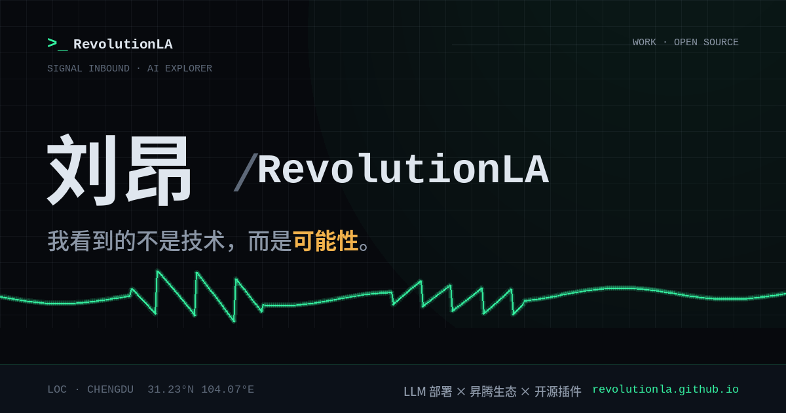

<div align="center">


</div>

<div align="center">

*“我看到的不是技术，而是可能性。” — I don't see technology; I see possibilities.*

西北工业大学毕业 · 华为六年研发 · 现居成都

[个人主页](https://revolutionla.github.io/) · [邮箱](mailto:liuang0307@foxmail.com) · 公众号《理工男的内心骄傲》

</div>

<div align="center">

> **"The best way to predict the future is to invent it."**
> 预测未来的最好方式，是把它亲手造出来。 — *Alan Kay*
>
> **"Talk is cheap. Show me the code."**
> 空谈无益，把代码摆上来。 — *Linus Torvalds*

</div>

## 关于我 / About

软硬件都碰一点，AI 投入最深。六年华为研发经历，从嵌入式与 FPGA 一路做到大模型部署调优与云服务架构；现在聚焦 **LLM 私有化部署** 与 **昇腾（Ascend）生态落地**，业余时间写一些让工具更好用的开源插件。

- 🔧 **LLM 部署**：推理框架选型、量化调优、私有化落地
- ⚡ **昇腾生态**：CANN / MindSpore，服务器部署与运维实践
- 🧩 **开源插件**：为常用工具做克制、耐用的增强
- 📐 **底层功底**：嵌入式、硬件电路与计算机体系结构

I work across hardware and software, but I go deepest on AI. Six years of R&D at Huawei took me from embedded systems and FPGAs to LLM deployment, quantization tuning and cloud service architecture. Today I focus on **private LLM deployment** and the **Ascend ecosystem**, and I spend my evenings writing restrained, durable open-source plugins for tools people already use.

## 开源作品 / What I Ship

十个仓库都在下面，按方向分组；完整介绍与在线演示都在 **[revolutionla.github.io](https://revolutionla.github.io/)**。

| 项目 · Project | 方向 | 一句话 · What it does | ★ |
|---|---|---|---|
| [**nextless**](https://github.com/RevolutionLA/nextless) · [deb](https://github.com/RevolutionLA/nextless/releases) | `输入法` | fcitx5 按住说话语音输入：触发键随便改（右 Ctrl 就行）、离线中英识别 Zipformer/FireRed、本地标点、错词修正表、`.deb` 一键装，基准带原始数据公开 · Typeless-style push-to-talk dictation for Linux: rebindable trigger key, offline zh/en ASR, local punctuation, mishearing fixes, one-command install | [](https://github.com/RevolutionLA/nextless) |
| [**dsh-dream-skin**](https://github.com/RevolutionLA/dsh-dream-skin) · [demo](https://revolutionla.github.io/dsh-dream-skin/) | `DSH` | DeepSeek Harness 换肤 / 主题包插件，8 套 Mirage 主题，纯 token 系统实现 · Skin, wallpaper & theme-pack engine for DeepSeek Harness | [](https://github.com/RevolutionLA/dsh-dream-skin) |
| [**call-recording-archive**](https://github.com/RevolutionLA/call-recording-archive) | `本地 AI` | 把散落的通话录音变成本地话务台：全文检索、按人按时间统计、关系图谱、音色克隆导出，100% 离线零上云 · Local-first archive for call recordings — search, stats, relation graph, FunASR powered | [](https://github.com/RevolutionLA/call-recording-archive) |
| [**adversarial-review**](https://github.com/RevolutionLA/adversarial-review) | `Agent` | 三方对抗式代码评审 Agent Skill，每条结论带证据链 · Tri-role adversarial code review for AI coding agents | [](https://github.com/RevolutionLA/adversarial-review) |
| [**ascend-assistant**](https://github.com/RevolutionLA/ascend-assistant) | `昇腾` | 用 AI 操作、查询、排障昇腾智算服务器的 Agent Skill · Agent skill that operates and debugs Ascend servers | [](https://github.com/RevolutionLA/ascend-assistant) |
| [**AscendMate**](https://github.com/RevolutionLA/AscendMate) | `昇腾` | 昇腾部署易用一指禅：环境、微调、推理、算子手册 · Ascend deployment field guide | [](https://github.com/RevolutionLA/AscendMate) |
| [**YuE2-Music-Workbench**](https://github.com/RevolutionLA/YuE2-Music-Workbench) | `音乐` | 100% 离线的本地 AI 音乐工作站：写歌 + 翻唱 + 换声 + 滚动歌词 · Offline local AI music workstation, a free Suno alternative | [](https://github.com/RevolutionLA/YuE2-Music-Workbench) |
| [**awesome-YuE**](https://github.com/RevolutionLA/awesome-YuE) | `音乐` | YuE / YuE2 开源音乐生成资源清单，收录近 70 个项目 · Curated list for open-source music generation | [](https://github.com/RevolutionLA/awesome-YuE) |
| [**OpenKidCar**](https://github.com/RevolutionLA/OpenKidCar) | `硬件` | 全程开源的亲子创客玩具车「干杯一号」，硬件到软件都归你 · Fully open-source smart car kids can build themselves | [](https://github.com/RevolutionLA/OpenKidCar) |
| [**shijing**](https://github.com/RevolutionLA/shijing) | `数据` | 用 Python 统计《诗经》全文用字概率，输出字云与词云 · Character-frequency analysis of the *Book of Songs* | [](https://github.com/RevolutionLA/shijing) |

> **上游贡献 · Upstream** — 自有仓库之外，我是 [yu1745/wetype-ime-linux](https://github.com/yu1745/wetype-ime-linux)（微信输入法 Linux 版）的 **#2 贡献者**：整页候选翻页并跟随 fcitx5 全局设置、候选词英文释义、上下文智能标点，7 个已合并提交。
> Beyond my own repos, I'm the **#2 contributor** to [yu1745/wetype-ime-linux](https://github.com/yu1745/wetype-ime-linux) (WeChat IME on Linux): global-following candidate paging, per-candidate English glosses, context-aware smart punctuation — 7 merged commits.

## 技术栈 / Tech Stack

<div align="center">

<a href="https://github.com/RevolutionLA/adversarial-review#安装">
  
</a>

<br/>
<br/>

[](https://github.com/RevolutionLA/adversarial-review) [](https://github.com/RevolutionLA/adversarial-review#安装)

<details>
<summary>一行命令装上我的三方对抗式评审 Skill · One-line install</summary>

```bash
npx skills add RevolutionLA/adversarial-review -a claude-code -a cursor -a opencode
```

</details>

<br/>


</div>

## 数字 / By the Numbers

<div align="center">

[](https://github.com/RevolutionLA?tab=repositories&q=sort%3Astars)
[](https://github.com/RevolutionLA?tab=followers)
[](https://github.com/RevolutionLA/dsh-dream-skin/graphs/contributors)
[](https://github.com/RevolutionLA/dsh-dream-skin/releases)

</div>

## 活动 / Activity

<picture>
  <source media="(prefers-color-scheme: dark)" srcset="https://raw.githubusercontent.com/RevolutionLA/RevolutionLA/output/github-contribution-grid-snake-dark.svg" />
  
</picture>

<table align="center" width="100%">
  <tr>
    <td align="center" width="50%" valign="top">
      
    </td>
    <td align="center" width="50%" valign="top">
      
    </td>
  </tr>
</table>

## 主页 / The Site

<div align="center">

<a href="https://revolutionla.github.io/"></a>

<sub>点图直达 <b>revolutionla.github.io</b> · 十个项目、star 读数与在线演示都在那里</sub>

</div>


## 联系我 / Contact

<div align="center">

📧 [liuang0307@foxmail.com](mailto:liuang0307@foxmail.com) ｜ 🌐 [revolutionla.github.io](https://revolutionla.github.io/) ｜ 💬 微信公众号 **《理工男的内心骄傲》**

</div>

---

<div align="center">


*Keep it simple. Keep it real.*

</div>
